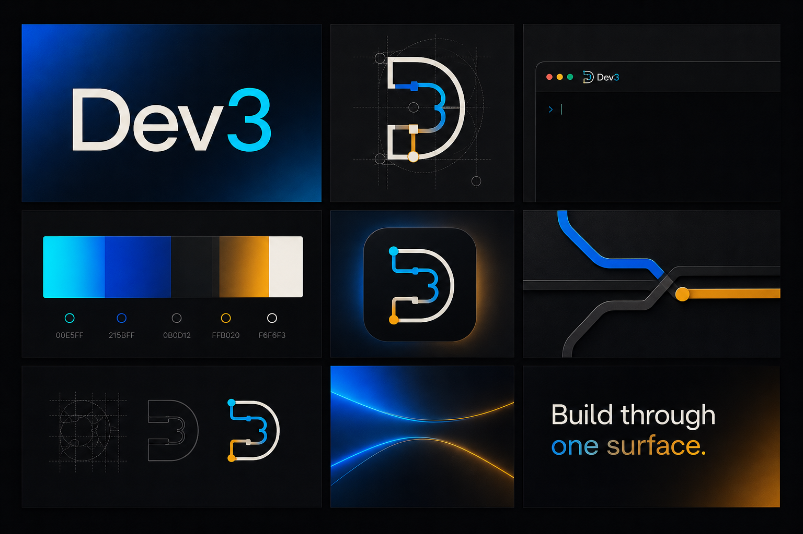

# Dev3

Dev3 is a TanStack Start application with a Convex backend and an optional
Electron desktop client. The desktop client loads the deployed web application in
a hardened Electron window and adds a local Codex bridge so users can sign in with
their ChatGPT account without sending OpenAI credentials to Convex.



## Web development

Install dependencies and start the web application:

```powershell
bun install
bun run dev
```

## Desktop development

Start the web development server and Electron together:

```powershell
bun run desktop:dev
```

The ChatGPT subscription option is shown only inside Electron. Codex OAuth and
session data are stored by the bundled Codex runtime under Electron's per-user app
data directory. Convex stores only non-secret account metadata used to identify the
connection.

To verify that the bundled Codex app-server can start and answer its account RPC
without opening the Electron UI, run:

```powershell
bun run desktop:codex:smoke
```

## Windows installer

The production desktop client is a thin wrapper around the deployed HTTPS web
application. Set its trusted renderer URL before packaging:

```powershell
$env:DEV3_DESKTOP_URL = "https://app.a2zsoftware.ca/"
bun run installer:windows
```

`installer:windows` first creates a fresh Electron package, then builds the x64
assisted NSIS installer. Outputs are written to:

- `out/packages/` for unpacked Electron packages
- `out/nsis/dev3-setup.exe` for the installer
- `out/nsis/latest.yml` and the installer blockmap for updates

Packaging rejects missing or non-HTTPS renderer URLs. It also rejects stale
package metadata and a packaged version that differs from `package.json`.
Windows installers are intentionally unsigned, so Windows may show an unknown
publisher or SmartScreen warning during installation.

## Updater releases

The updater publishes to this public repository, `Zain-Repo/ai-app`, so
installed clients can read releases without an embedded GitHub credential. The
repository is a fixed part of the updater contract: the publisher, generated
updater metadata, runtime manifest lookup, and public download links must all
remain on `Zain-Repo/ai-app`.

The release publisher reads the Codex version from the packaged executable and
fails if it is behind OpenAI's latest stable `@openai/codex` release. It creates
or resumes a draft GitHub release, uploads the installer, blockmap, `latest.yml`,
and Codex runtime manifest, verifies that every expected asset is present, and
only then publishes the release as latest. A failed upload therefore leaves a
draft instead of exposing a partial updater release.

## GitHub Actions CI and releases

CI runs on pull requests, pushes to `master`, and manual dispatch. It installs
the locked Bun dependencies, checks GitHub Actions workflow YAML formatting,
then runs type checking, Vitest, and the production build.

After CI succeeds for a push to `master`, CI calls the Windows release workflow
with the exact tested commit. Pull requests, manual CI runs, failed validation,
and pushes to other branches cannot invoke the release job. The release workflow
also verifies that the tested commit is still the tip of `origin/master` before
packaging and again immediately before publishing.

`package.json` is the release-version source of truth. Version `MAJOR.MINOR.PATCH`
produces Git tag `vMAJOR.MINOR.PATCH`; bump the package version in the change that
should create the next desktop release. If that version is already published,
the release workflow exits successfully without rebuilding or replacing its
assets. A new version builds the unsigned installer and atomically publishes the
updater assets to `Zain-Repo/ai-app`.

Configure these GitHub repository settings before the first release:

Required variables:

- `DEV3_DESKTOP_URL`: the absolute HTTPS URL loaded by the desktop client.

Legacy `AI_HARNESS_*` packaging variables remain supported as fallbacks so
existing release environments can migrate without interrupting updates.

The release workflow uses its scoped GitHub Actions token to create and upload
the Git tag and GitHub release; no personal access token is required. Keep the
repository public so installed clients can download updater assets without
credentials. The workflow is intentionally not configured for manual release
dispatch or publication to another repository.

## Unsigned Windows releases

Windows release builds do not use Authenticode signing certificates or signing
secrets. `bun run installer:windows` packages the application and NSIS installer
unsigned for both local builds and GitHub releases. Users should expect Windows
to identify the publisher as unknown and may need to confirm a SmartScreen
warning before installation.
